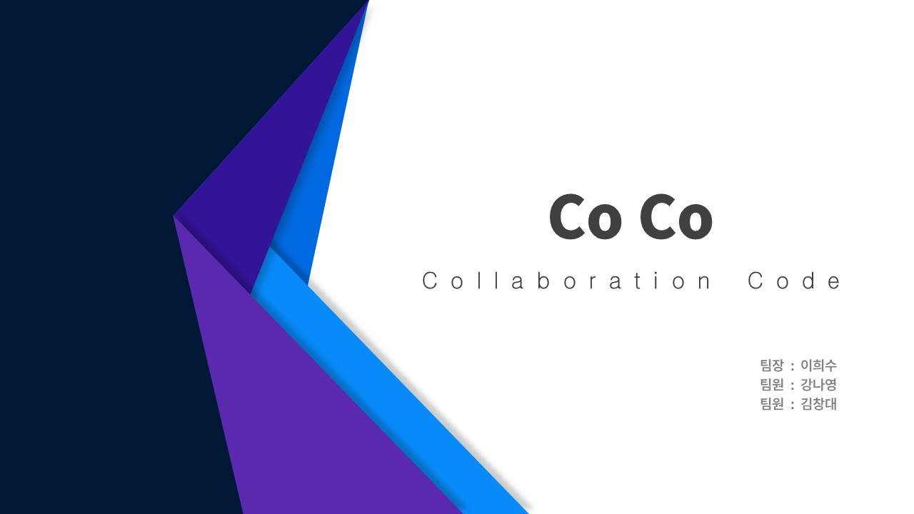
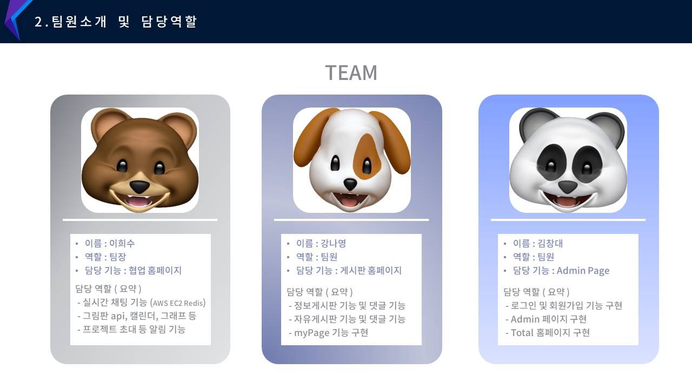
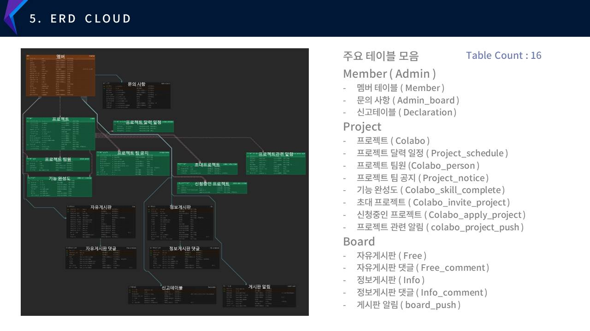
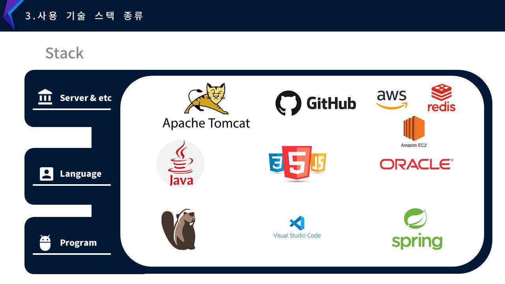
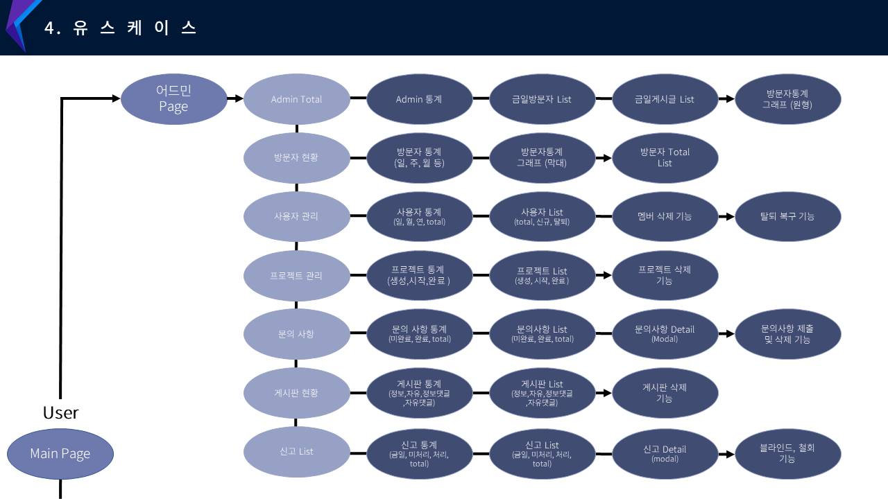
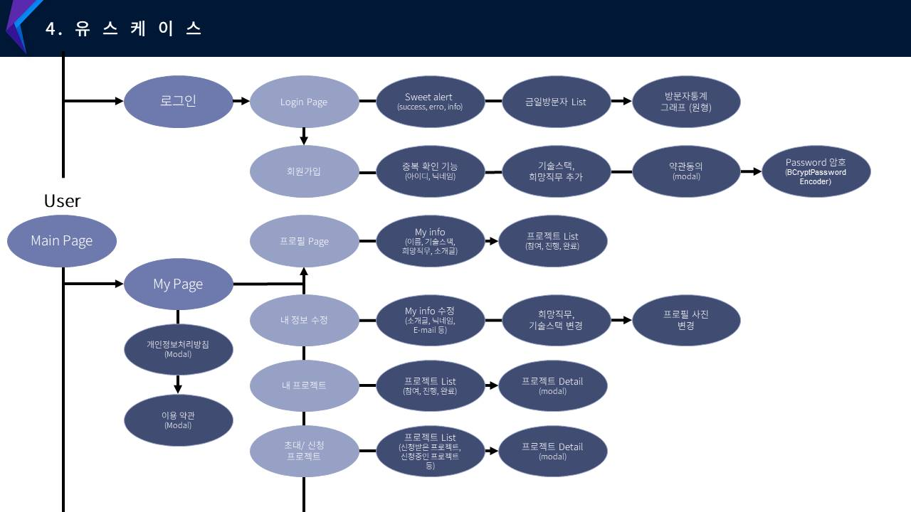
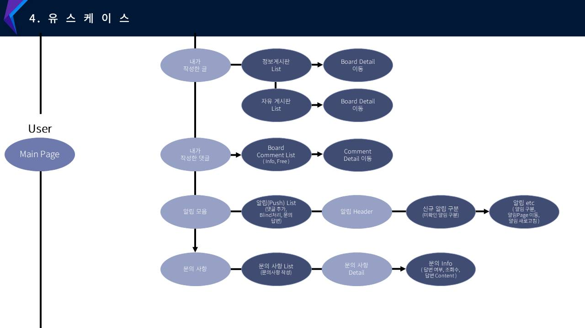
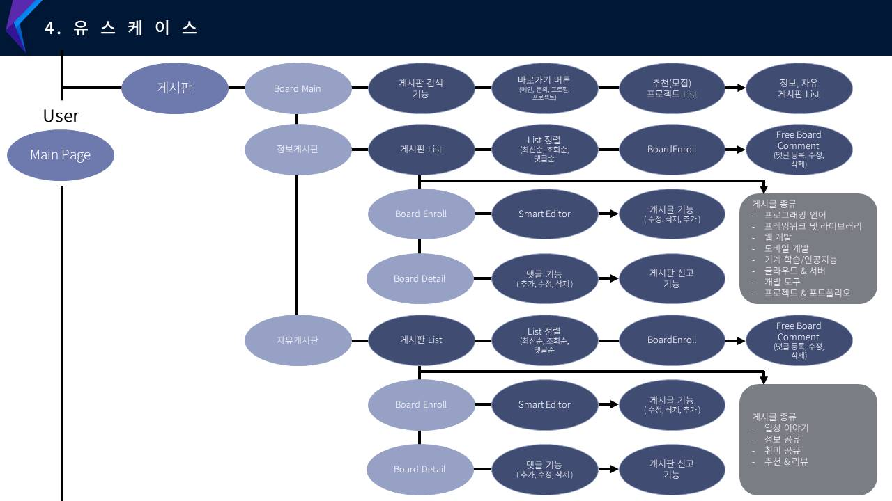
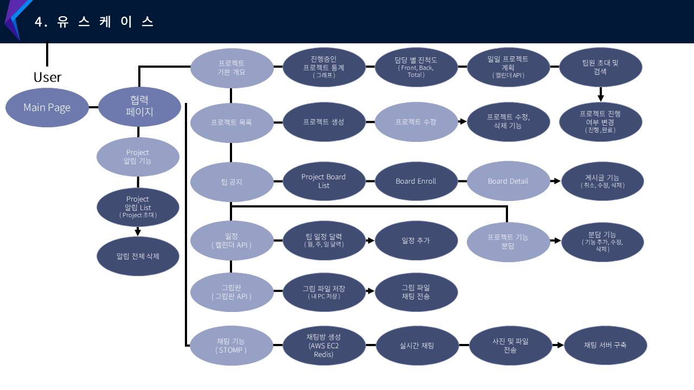

# COCO 프로젝트 (협업 일정관리 및 커뮤니티 웹 프로젝트)

   
  
   

## 프로젝트 소개

- COCO 프로젝트는 자신의 아이디어를 구상하고 팀원을 모아 서로가 협동 및 협력하여 Project를 만드는
  개발자들의 일정관리 및 협업 환경을 제공해주는 서비스와 더불어 개발자들의 정보 공유 게시판 및 프로젝트 추천, 자유 게시글을 만들 수 있는 웹페이지 프로젝트 입니다.

  
- 진행기간 : 2024년 01월 18일 → 2024년 02월 26일 의 기간동안 진행했습니다.

 

## 팀원소개 & 기능

   
  
   

 

## ERD CLOUD

   
  
   

## 기술 스택

   
  
   

## 유스케이스

   
  
   

   
  
   

   
  
   

   
  
   

   
  
   

 

## 내 기능 구현
#### 상세 기능 설명은 각 페이지별 링크 연결해두었습니다.
####  [1. 프로젝트 생성 & 사용자 초대 & (월간,일간)일정등록 및 초대알림(알림부분 마지막설명)]

 

 

#### [2. 프로젝트 기능분담 ]
 

 

#### [3. 프로젝트 팀공지게시판, 그림판 API]
 

 

#### [4. 프로젝트 수정, 인터셉터처리, 글자 수 제한]
 

 

#### [5. 프로젝트 진행,완료,초대,초대참가 알림]
 

 

#### [6. 프로젝트 신청,신청참가 알림]
 

 

#### [7. 채팅웹 ]
 

 

## 배운 점 & 아쉬운 점

  
-  ㅁㄴㅇ

- <strong>작성일 2024- 이희수</strong> 

 
